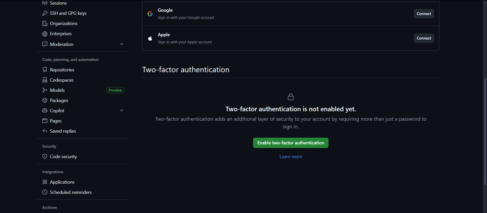

# ALERT MANAGER

## HITO 1: CREACIÓN DEL REPOSITORIO Y DEFINICIÓN DEL PROBLEMA

### Algunos aspectos previos de GitHub

#### Doble factor de autenticación

Para mejorar la seguridad, se ha activado el doble factor de autenticación haciendo uso de Google Authenticator. 

Para su configuración, basta con activarlo en el apartado Settings de GitHub.

Tras empezar el proceso, deberemos enlazar Google Authenticator con un QR y guardar las claves de recuperación en un lugar seguro.

### Origen del problema

El problema se basará en el backend de un proyecto de la asignatura del máster GIDM.  
El backend se puede consultar aquí: [API ALERTAS](https://github.com/davidmunozsanchez/alertas_api).

La idea detrás de este código es gestionar de forma eficiente alertas meteorológicas, accidentes, es decir, toda comunicación por parte de las autoridades que necesite llegar al mayor número posible de personas y, además, crear un registro fiable de numerosas fuentes, aglutinando todo tipo de alertas.

La estructura de este repositorio es la siguiente:

- **app/** — carpeta que contiene el código de la API Rest. Se incluyen endpoints para la carga y visualización de puntos, así como validación de información con Pydantic. Además, se implementan endpoints para búsquedas con filtros.

- **dags/** — carpeta de Airflow donde se definen flujos de trabajo programados (“Directed Acyclic Graphs”, DAGs) para tareas automáticas. En este caso, hay un DAG encargado de monitorizar si un archivo en el repositorio cambia o no, y otro que, en caso de cambio, ingesta los puntos en la base de datos.

- **load_data.py** — script para cargar datos iniciales o realizar la ingestión de datos.

En este punto ya se puede observar que el backend se diseñó originalmente como apoyo a la aplicación Android que se estaba desarrollando, a modo de prueba.  
Sin embargo, en este proyecto, cuyo objetivo es resolver un problema mediante uno o varios servicios desplegados en la nube, se podría profundizar mucho más en el aspecto de la carga de puntos, algo que se abordará al finalizar esta sección.

- **reset_db.py** — script para reiniciar la base de datos (limpiar tablas y volver al estado inicial).

- **Dockerfile**, **docker-compose.yml**, **start.sh** — para empaquetar todo el sistema en contenedores Docker y orquestar los servicios.  
  El archivo `docker-compose.yml` contiene los siguientes servicios y volúmenes:

  - **db**: PostgreSQL  
  - **web**: API de alertas, conecta con `db`, expuesta en el puerto `8000`  
  - **airflow-db**: PostgreSQL exclusivo para Airflow  
  - **airflow-webserver**: interfaz web de Apache Airflow (puerto `8080`)  
  - **airflow-scheduler**: planifica y ejecuta tareas de Airflow  
  - **pgdata**: datos de la base de datos principal  
  - **airflow_pgdata**: datos de Airflow  

- **.env** — archivo con variables de entorno (credenciales, URLs, configuración).

---

### Definición del problema

Como ya se ha comentado anteriormente, el problema a tratar se inspira en el proyecto original, pero desde el principio se buscará una mejora en el backend para dotarlo de mucha más funcionalidad, pensando en una posible aplicación futura, así como en aprovechar las numerosas ventajas del Cloud Computing.

Por una parte, hay que gestionar la **obtención e ingestión de alertas** en la base de datos.  
Para ello, se crearán **DAGs de Airflow** encargados de realizar *web scraping* en ciertas fuentes y consultar periódicamente **APIs públicas de alertas**.  
Con esto, se irá actualizando la base de datos de forma automática.

Airflow también se encargará de adaptar todos los datos a un formato que permita introducir las alertas en la base de datos relacional.  
Al tratarse de datos con los que se consultarán relaciones complejas (por ejemplo, alertas activas o inactivas, alertas de cierta comunidad, etc.), tiene sentido usar una base de datos relacional.  
Además, se pretende realizar una **refactorización del código existente** para aprovechar **PostGIS**, la extensión geoespacial de PostgreSQL, optimizando así las consultas sobre datos geográficos.

Por último, se creará una **API Rest** para la administración y gestión de alertas por parte de varios tipos de usuarios:

- **Admin**
- **Técnico**
- **Usuario**

El rol de “Técnico” incluirá varias subcategorías de profesionales, cada uno con diferentes funciones según el tipo de alertas que tengan permitido gestionar.

Para ello, se hará uso de **FastAPI**.  
Disponer de una API permitirá integrarla fácilmente con la aplicación Android que ya se estaba desarrollando o incluso con una futura aplicación web. La app se puede consultar aquí: [APP ANDROID](https://github.com/davidmunozsanchez/alertas_app)

En cuanto a la seguridad, actualmente se usa **Firebase** para gestionar los inicios de sesión y los logins.  
Este sistema permanecerá sin cambios.

Todo esto está pensado para ejecutarse a través de **contenedores Docker**.  
Lo descrito en este último apartado está sujeto a cambios, aunque el objetivo de esta sección es explicar el problema desde una perspectiva práctica, aprovechando la infraestructura ya creada.  
Si se introdujera algún cambio en el futuro, se corregirían debidamente los archivos **README** relacionados.

