# Despliegue, observabilidad y pruebas en la nube – Alert Manager

## 1. Elección del IaaS/PaaS y justificación

Se ha seleccionado **Oracle Cloud Infrastructure (OCI) - Oracle Kubernetes Engine (OKE)** en la región `eu-frankfurt-1` (Europa) para el despliegue de la aplicación. OKE es un servicio de Kubernetes gestionado, por lo que se clasifica como PaaS (Platform as a Service) sobre la capa IaaS de OCI, ofreciendo gestión de clústeres, actualizaciones y escalado sin gestionar directamente la infraestructura subyacente.

### Razones de la elección:
- **Always Free Tier**: permite ejecutar un clúster Kubernetes real, con 4 OCPU y 24GB RAM ARM, almacenamiento y balanceador de carga sin coste.
- **Despliegue en Europa**: cumple requisitos legales de protección de datos.
- **Recursos suficientes**: el clúster soporta múltiples pods (API, Airflow, PostgreSQL, observabilidad) y pruebas de carga razonables para el alcance académico.
- **Automatización y reproducibilidad**: toda la infraestructura se define en YAMLs y scripts versionados, permitiendo reproducir el entorno desde cero.

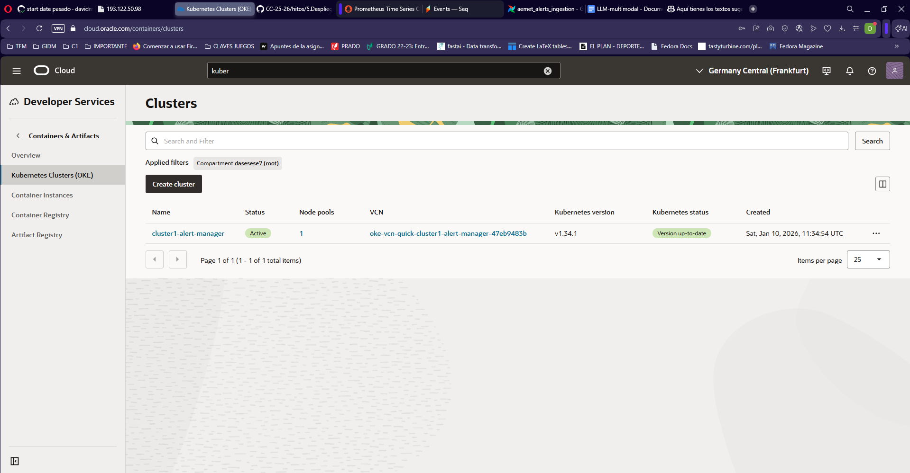

> **Diferencia Docker vs Kubernetes**: Docker permite ejecutar contenedores de forma aislada en una máquina, ideal para desarrollo local y pruebas. Kubernetes (K8s) orquesta múltiples contenedores (pods), gestiona escalado, auto-recuperación, redes y almacenamiento, ideal para producción y alta disponibilidad.

---

## 2. Herramientas y proceso de despliegue

- **Repositorio GitHub**: código fuente, Dockerfiles, manifiestos K8s y scripts CI/CD.
- **GitHub Actions**: automatiza build, push y despliegue en OKE tras cada push a main/hito5.
- **Kubernetes YAMLs**: definen deployments, servicios, ingress, configmaps y secrets.
- **OCI CLI y kubectl**: Scripts reproducibles para crear namespace, aplicar recursos y gestionar secretos.
- **Despliegue reproducible**: cualquier usuario autorizado puede levantar la infraestructura ejecutando los scripts y YAMLs proporcionados.

---

## 3. Despliegue automático desde GitHub

- El workflow `.github/workflows/deploy-kubernetes.yml` automatiza:
  - Build y push de imágenes Docker a GHCR.
  - Configuración de secrets y configmaps.
  - Aplicación de recursos K8s vía Kustomize.
  - Health check automático del API tras despliegue.

---

## 4. Observabilidad y monitorización

- **Prometheus**: despliegue vía YAML, monitoriza métricas de nodos y pods.
- **Node Exporter**: métricas de CPU, RAM, disco y red de los nodos.
- **Seq**: centralización de logs de la aplicación.
- **Airflow UI**: monitorización de DAGs y tareas.
- **Pruebas de queries Prometheus**: (ver PROMETHEUS_QUERIES.md)

> **Ejemplo de query para CPU:**
> ```
> sum(rate(node_cpu_seconds_total{mode!="idle"}[5m])) by (instance)
> ```

---

## 5. Pruebas y validación

### Pruebas funcionales
API testada con curl (ver CURL_EXAMPLES.md).

### Pruebas de estrés
Se realizaron pruebas de carga usando herramientas como `ab` (Apache Benchmark) o `wrk` para simular múltiples peticiones concurrentes al endpoint principal de la API.

_Ejemplo de comando:_
```sh
ab -n 1000 -c 50 http://<PUBLIC_URL>/alerts/
```

### Acceso a Prometheus para monitorizar pruebas

Para ver métricas en tiempo real durante la prueba de estrés:

1. Haz port-forward del servicio Prometheus a tu máquina local:

```sh
kubectl port-forward -n alert-manager svc/prometheus 9090:9090
```

2. Abre tu navegador en [http://localhost:9090](http://localhost:9090)

3. Las Queries se meten en el apartado correspondiente de Prometheus.

Lo siguiente, ha sido la ejecución del test:
```
da01m@davidpc:/mnt/c/Users/da01m/Documents/GitHub/alert_manager$ ab -n 1000 -c 50 http://141.147.25.0/alerts/
This is ApacheBench, Version 2.3 <$Revision: 1903618 $>
Copyright 1996 Adam Twiss, Zeus Technology Ltd, http://www.zeustech.net/
Licensed to The Apache Software Foundation, http://www.apache.org/

Benchmarking 141.147.25.0 (be patient)
Completed 100 requests
Completed 200 requests
Completed 300 requests
Completed 400 requests
Completed 500 requests
Completed 600 requests
Completed 700 requests
Completed 800 requests
Completed 900 requests
Completed 1000 requests
Finished 1000 requests


Server Software:        uvicorn
Server Hostname:        141.147.25.0
Server Port:            80

Document Path:          /alerts/
Document Length:        7634 bytes

Concurrency Level:      50
Time taken for tests:   14.133 seconds
Complete requests:      1000
Failed requests:        400
  (Connect: 0, Receive: 0, Length: 400, Exceptions: 0)
Non-2xx responses:      400
Total transferred:      5142363 bytes
HTML transferred:       4629600 bytes
Requests per second:    70.76 [#/sec] (mean)
Time per request:       706.651 [ms] (mean)
Time per request:       14.133 [ms] (mean, across all concurrent requests)
Transfer rate:          355.33 [Kbytes/sec] received

Connection Times (ms)
Time per request:       14.133 [ms] (mean, across all concurrent requests)
Transfer rate:          355.33 [Kbytes/sec] received

Connection Times (ms)
          min  mean[+/-sd] median   max
Connect:       36   48  74.1     42    1104
Processing:    41  648 644.3    357    2353
Waiting:       40  479 436.1    331    1551
Total:         78  696 649.0    401    3168

Time per request:       14.133 [ms] (mean, across all concurrent requests)
Transfer rate:          355.33 [Kbytes/sec] received

Connection Times (ms)
          min  mean[+/-sd] median   max
Connect:       36   48  74.1     42    1104
Processing:    41  648 644.3    357    2353
Time per request:       14.133 [ms] (mean, across all concurrent requests)
Transfer rate:          355.33 [Kbytes/sec] received

Connection Times (ms)
Connection Times (ms)
          min  mean[+/-sd] median   max
Connect:       36   48  74.1     42    1104
Processing:    41  648 644.3    357    2353
Waiting:       40  479 436.1    331    1551
Total:         78  696 649.0    401    3168

Percentage of the requests served within a certain time (ms)
  50%    401
  66%    989
  75%   1191
  80%   1267
  90%   1699
  95%   1951
  98%   2081
  99%   2183
 100%   3168 (longest request)
```
**Comentarios sobre los resultados:**

- Se observa que de 1000 peticiones, 400 fallaron ("Failed requests: 400"), lo que indica problemas de capacidad o errores en la aplicación bajo alta concurrencia.
- El número de respuestas no exitosas ("Non-2xx responses: 400") coincide con los fallos, lo que refuerza la hipótesis de saturación o errores en el endpoint.
- El tiempo medio por petición fue de 706 ms, con una mediana de 401 ms, pero algunos picos llegaron hasta 3168 ms, mostrando alta variabilidad y posibles cuellos de botella.
- La tasa de peticiones servidas fue de ~71 req/s, adecuada para pruebas académicas pero mejorable para producción.
- El procesamiento y la espera muestran desviaciones estándar altas, lo que sugiere que el sistema no mantiene un rendimiento constante bajo carga.

En seq, se puede observar:
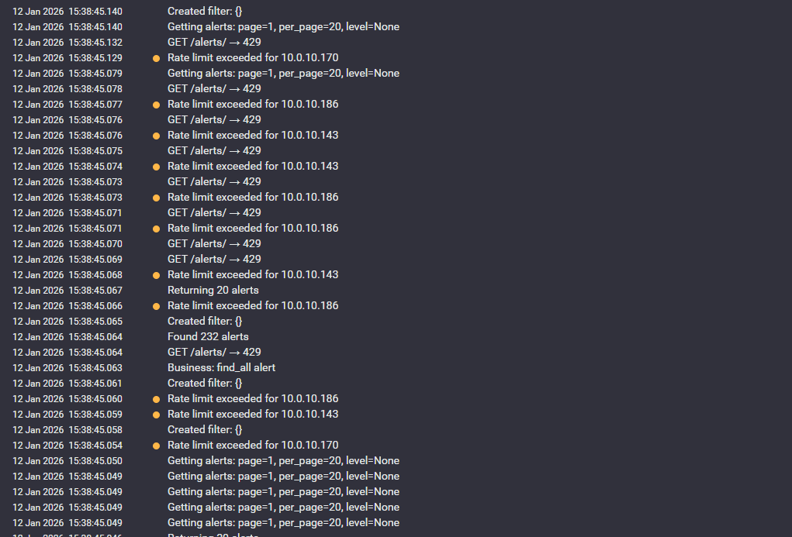

Durante las pruebas de estrés, la API puede devolver errores `429 Too Many Requests` con el mensaje `Rate limit exceeded`. Esto es esperado y correcto, ya que la aplicación implementa un rate limiting nativo (100 peticiones por minuto por IP) para proteger el servicio frente a abusos y garantizar la disponibilidad para todos los usuarios.

Este límite es adecuado en producción para evitar sobrecarga y ataques de denegación de servicio. Durante pruebas de estrés, documentar la aparición de estos errores demuestra que la protección funciona correctamente.

- **CPU total usada por nodo:**
  ```
  sum(rate(node_cpu_seconds_total{mode!="idle"}[5m])) by (instance)
  ```
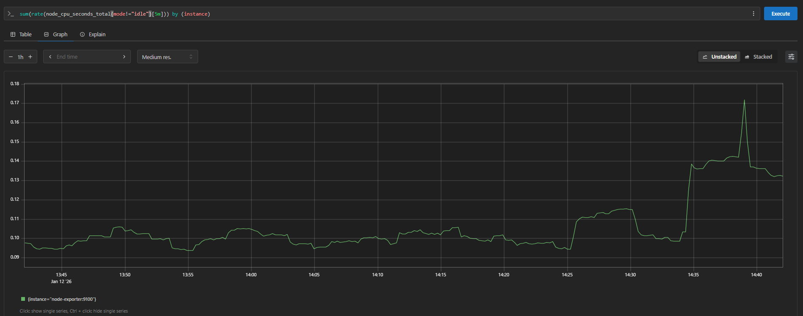

A partir de las 14:35, cuando se ejecutó la prueba, se observa más uso del CPU.
- **Memoria libre por nodo:**
  ```
  node_memory_MemAvailable_bytes
  ```
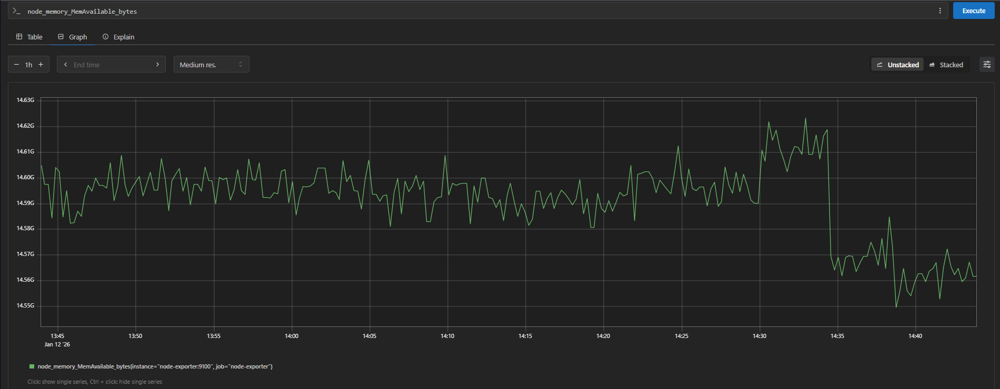

Aquí la memoria disponible cae a partir de esa hora.
- **Porcentaje de memoria usada:**
  ```
  100 * (1 - (node_memory_MemAvailable_bytes / node_memory_MemTotal_bytes))
  ```
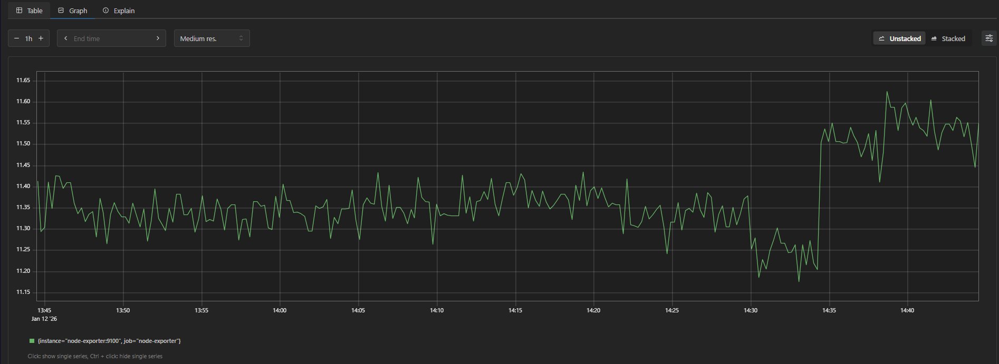

Y como no podía ser de otra forma, la memoria usada aumenta a su vez a esa hora.


### Pruebas de resiliencia
Se forzó el borrado de pods críticos (API, Airflow, PostgreSQL) para comprobar la auto-recuperación del clúster y la persistencia de datos.

Antes de adjuntar las capturas, veamos el estado de OKE funcionando:
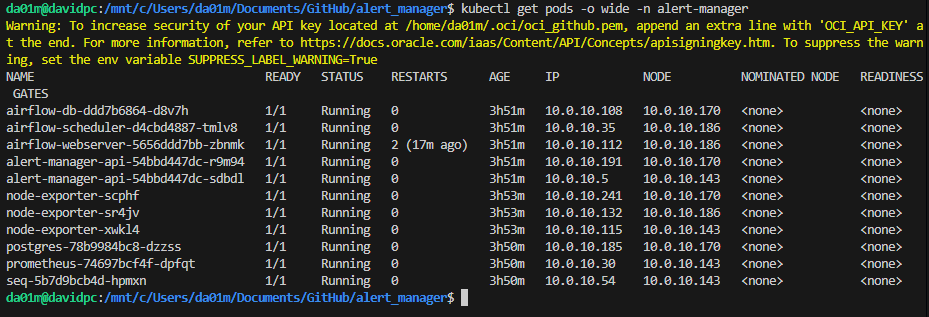

### Comandos para pruebas de resiliencia

Para comprobar la auto-recuperación del clúster, borra los pods críticos y observa cómo Kubernetes los reinicia automáticamente:

```sh
# Borrar el pod de la API
kubectl delete pod -n alert-manager -l app=alert-manager-api

# Borrar el pod de Airflow webserver
kubectl delete pod -n alert-manager -l app=airflow-webserver

# Borrar el pod de PostgreSQL
kubectl delete pod -n alert-manager -l app=postgres
```

Observa con:
```sh
kubectl get pods -n alert-manager -w
```
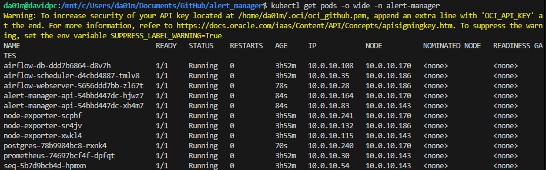

La edad de los servicios tumbados es mucho más baja como se puede observar, y ya están funcionando de nuevo.

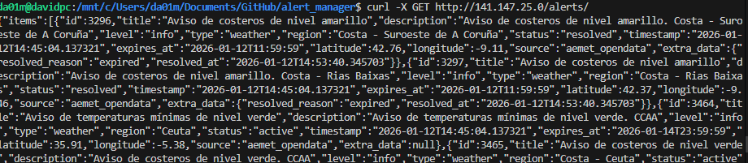

Y también sigue devolviendo alertas.

---

### Pruebas de latencia
Se midió la latencia de respuesta de la API en una única petición y con wrk.

### Comandos para pruebas de latencia

Se puede medir la latencia de la API con ab, wrk o curl:

```sh

# wrk: muestra latencias por percentil
wrk -t1 -c1 -d30s http://141.147.25.0/alerts/

# curl: latencia de una petición individual
curl -w "Tiempo total: %{time_total}s\n" -o /dev/null -s http://141.147.25.0/alerts/

Interpretación del resultado de wrk:

- Se lanzaron 734 peticiones en 30 segundos con 1 hilo y 1 conexión.
- La latencia media fue de 40.81 ms, con baja variabilidad (6.55 ms de desviación estándar).
- La mayoría de las peticiones (634 de 734) recibieron un error (probablemente 429 Too Many Requests por rate limit), lo que es correcto y esperado según la configuración de la API.
- Requests/sec: 24.43. La API puede servir ~24 peticiones por segundo por conexión antes de que el rate limit actúe.
- El sistema mantiene la latencia baja y estable para las peticiones permitidas, y protege el backend limitando el exceso de tráfico.

Esto demuestra que la protección de rate limiting funciona correctamente y que la API responde rápido bajo carga controlada.

Resultado de curl individual:


curl -w "Tiempo total: %{time_total}s\n" -o /dev/null -s http://141.147.25.0/alerts/
# Salida:
Tiempo total: 0.101977s


Esto indica que, en condiciones normales y sin saturación, la API responde en torno a 100 ms por petición, lo cual es un tiempo de respuesta adecuado para una API REST en la nube.
```
Los resultados de wrk:
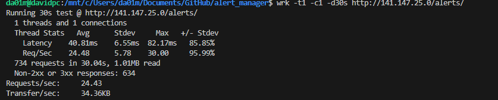

### Pruebas de UI
Captura de la UI de Airflow mostrando DAGs activos y ejecuciones:

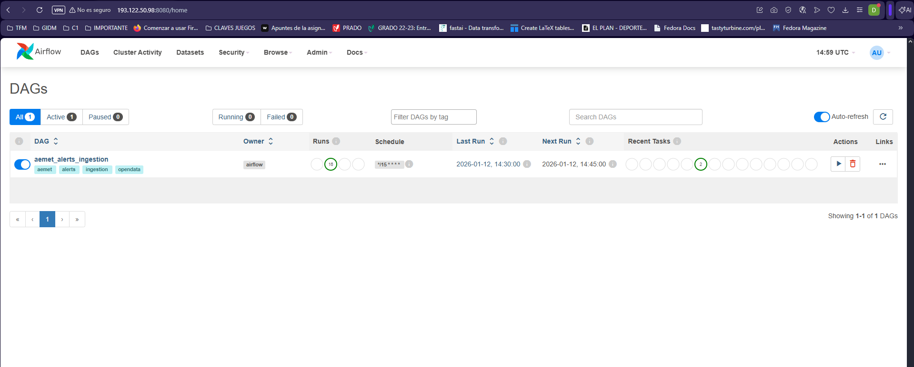
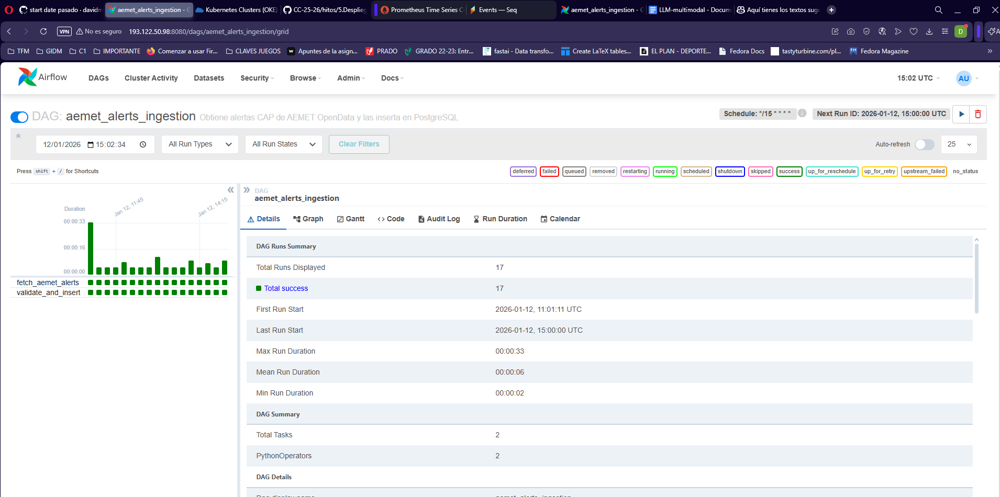
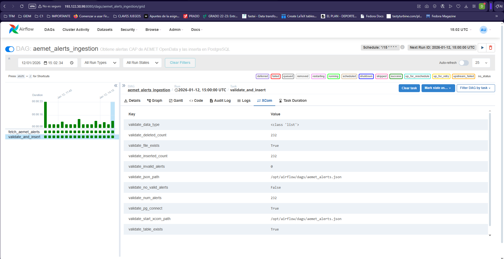

Como se puede observar, Airflow se ejecuta cada 15 minutos.

A continuación, se muestra, a partir de una ejecución limpia, como se rellena automáticamente la base de datos.
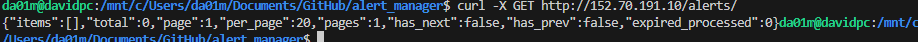

No hay alertas.

Si hacemos una ejecución manual del DAG:
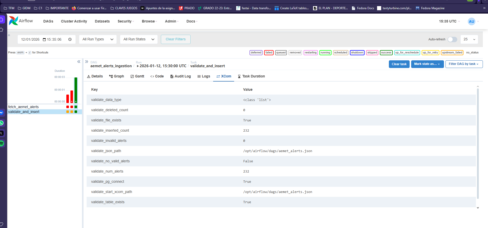

Y volvemos a pedir las alertas:
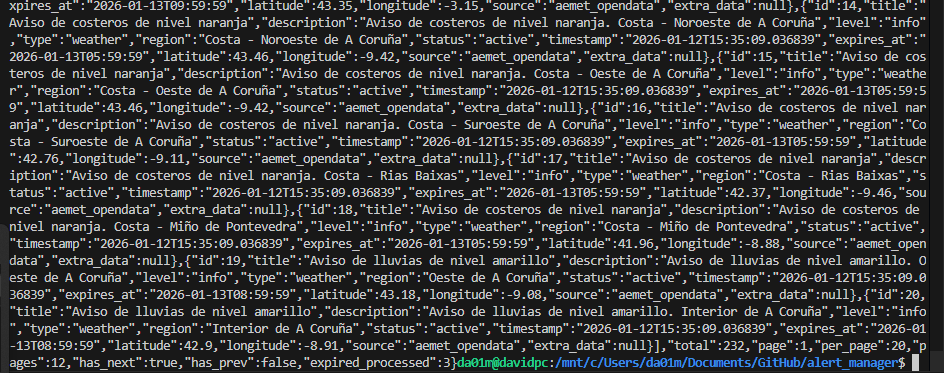

De Prometheus y Seq se han mostrado varias capturas a lo largo del documento. Hay que tener en cuenta que Airflow tarda un poco en estar listo, por eso algunos DAGs salen fallados. Además, el cluster test puede fallar.

---

## 7. Enlaces y Documentación

- [KUBERNETES.md](./hito5/KUBERNETES.md)
  Este archivo describe la configuración, manifiestos y pasos necesarios para desplegar la infraestructura y los servicios de la aplicación en un clúster Kubernetes, incluyendo ejemplos de uso de kubectl y recomendaciones para la gestión de recursos en OKE.
- [PROMETHEUS_QUERIES.md](./hito5/PROMETHEUS_QUERIES.md)
  Este archivo recopila ejemplos de consultas (queries) para Prometheus, utilizadas en la monitorización y análisis de métricas del clúster y la aplicación. Incluye queries para CPU, memoria, uso de recursos y otros indicadores clave, facilitando la interpretación de los datos recogidos por Prometheus.
- [CURL_EXAMPLES.md](./hito5/CURL_EXAMPLES.md)
  Este archivo contiene ejemplos prácticos de comandos `curl` utilizados para probar los distintos endpoints de la API, incluyendo peticiones de ejemplo, parámetros y posibles respuestas. Es útil para validar el funcionamiento de la API y como referencia rápida para realizar pruebas manuales desde la línea de comandos.
 - [.github/workflows/deploy-kubernetes.yml](.github/workflows/deploy-kubernetes.yml)
   
   Este archivo es el workflow principal de CI/CD para el despliegue automático en Oracle Kubernetes Engine (OKE). Se encarga de construir las imágenes Docker, subirlas al registro (GHCR), aplicar los manifiestos de Kubernetes (deployments, services, configmaps, secrets) y realizar health checks tras el despliegue. El proceso se lanza automáticamente con cada push a la rama main/hito5, garantizando que la infraestructura y la aplicación estén siempre actualizadas y reproducibles. El workflow utiliza los scripts y credenciales configurados en el repositorio para interactuar con OCI y el clúster Kubernetes, permitiendo un despliegue desatendido y seguro.

   Al final, se dejó solo para ejecutarse en el despliegue de Main.

- [AEMET INFO](./hito5/AEMET_SETUP.md)
  Este archivo proporciona la información necesaria sobre la API de AEMET y cómo se usa.

---

## 8. Próximos pasos y mejoras

- **Autenticación de usuarios con Firebase**: Está previsto implementar autenticación y gestión de usuarios utilizando Firebase Authentication, permitiendo acceso seguro y personalizado a la API y la UI. Esto facilitará la gestión de permisos y la trazabilidad de las acciones de los usuarios.

- **Integración DGT 3.0**: Se ha solicitado acceso a la nueva API de la Dirección General de Tráfico (DGT 3.0). Cuando se conceda, se integrarán los datos en tiempo real de tráfico y alertas, mejorando la calidad y actualidad de la información gestionada por el sistema.

 - **Scrapping en desarrollo**: ya existe un script inicial que automatiza la extracción de datos de fuentes públicas, especialmente de la página del mapa de la DGT. Para este proceso se está utilizando Playwright, que permite controlar el navegador y simular interacciones complejas (zoom, clicks, navegación entre marcadores) que son necesarias debido a la dificultad de acceder a cada marcador individualmente en el mapa interactivo. El reto principal es que los datos no están todos accesibles en el HTML inicial, sino que requieren navegar y hacer zoom para que se carguen dinámicamente. El flujo previsto es: automatización de la navegación con Playwright, extracción de los datos clave de cada marcador, y almacenamiento en la base de datos para su posterior ingesta y análisis en los DAGs de Airflow. También se contempla complementar el proceso con BeautifulSoup y Selenium para otras fuentes menos dinámicas.

 Los archivos se pueden consultar en [script](../src/app/extract_dgt_markers_production.py) y [DAG](../src/dags/dgt_traffic_ingestion.py)
